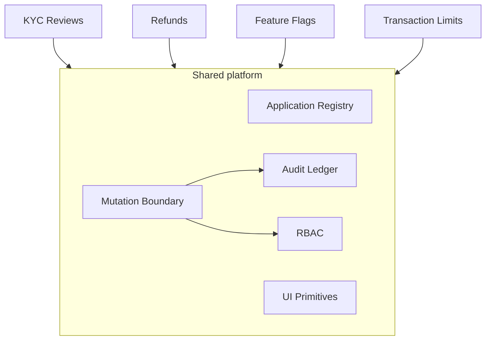

# Fintech Operations

A time-boxed technical feasibility prototype exploring whether a reusable, code-owned internal tools platform combined with Devin could provide a viable alternative to building future internal workflows in Microsoft Power Apps.

Customer context:

- Series C fintech
- approximately 60 engineers
- approximately $250K/year Power Apps spend
- 3 existing internal applications
- 10+ additional internal applications planned

The goal was **not** to recreate Microsoft Power Apps. The goal was to test whether reusable engineering primitives plus Devin could make additional owned internal applications progressively easier to build, without repeatedly redesigning security, auditing, and UI conventions for each new tool.

## What I Built

Four internal applications on one shared platform, plus an Overview page and an Audit Log.

### KYC Reviews

Operational KYC queue: risk and status filtering, per-case verification checks (identity, sanctions, address, document), a review drawer with customer and submission detail, approve / reject / escalate, required decision reasons, RBAC, and a shared audit trail. Approving a case that still has failed or unresolved checks is demoted from the primary action and requires an explicit acknowledgement.

### Refunds

Refund review queue: search and filters, transaction and customer-claim context alongside what operations already knows about the charge, approve / reject, required decision reasons, RBAC, and a shared audit trail. Amounts are held in minor units.

The prototype records refund authorization decisions. It does **not** move money or call a payment processor.

### Feature Flags

Feature flag administration: environment, enabled state, rollout percentage, owner, inspect, enable / disable, rollout changes, an explicit confirmation and acknowledgement for production flags, RBAC, and a shared audit trail. Unlike the two queues above, flag changes are repeatable parameter changes rather than terminal decisions.

The prototype changes simulated configuration. It does **not** serve feature flags to live application traffic.

### Transaction Limits

Account search, current daily transaction limit, pending limit-change requests, request submission, Admin approval and rejection, Reviewer request submission without decision rights, Read Only access, RBAC, and a shared audit trail. Requesting and deciding are separate permissions on the same entity, so a request records an intent and only an approval moves the recorded limit.

The prototype records configured limits. It does **not** enforce those limits during transaction authorization.

Transaction Limits was added after the first three applications, specifically as an extension experiment: the input was the business requirements plus the existing repository, rather than a fresh architectural specification.

## Architecture



Layout in the repository:

| Path | Contents |
| --- | --- |
| `platform/registry.ts` | Application catalog; navigation, Overview and per-app write permissions derive from it |
| `platform/rbac.ts` | Roles, permissions, role-to-permission matrix |
| `platform/mutate.ts` | The single write path for every application |
| `platform/audit.ts` | Read-only view of the ledger; the write side is platform-internal |
| `platform/ui/` | Shared primitives: data table, filter bar, confirm dialog, drawer focus, badges, panels |
| `lib/<app>/` | Per-application mutation layers and tests |
| `lib/data/` | Deterministic fixtures and in-memory stores |
| `app/(shell)/<app>/` | Pages, server actions and drawers |

### The mutation path

```
application requests a mutation
  -> platform resolves the current actor from the session
  -> platform authorizes the required permission
  -> operation executes
  -> audit event recorded (success, denied or error)
```

Three properties hold for all four applications:

- Applications do not supply their own actor identity. They describe the operation; the platform decides who is performing it.
- Applications do not create audit events. `platform/audit.ts` exposes no write function, and ESLint blocks application code from importing the internal ledger.
- Applications do not bypass the mutation boundary for business writes. Store mutations happen only inside the `apply` callback passed to `mutate()`.

Denied and failed attempts are audited too, so an operator who tries something they are not permitted to do leaves a record.

This is the paved road for future internal tools: a new application is a registry entry, permissions in the existing matrix, a deterministic store, a mutation layer over `mutate()`, and pages built from the shared primitives.

## Agentic Development Model

The workflow was not "Devin wrote the code":

```
requirements
  -> Devin implementation
  -> deterministic validation (tests, lint, typecheck, build)
  -> browser verification of the actual workflow
  -> independent review where appropriate
  -> human decision on what to accept
  -> targeted correction
```

`AGENTS.md` defines repository constraints, and the existing applications serve as reference implementations for the next one. Later applications were specified mostly in business terms; engineering conventions came from the repository itself.

**Engineering defines the paved road. Devin operates inside it.**

An independent review of the initial foundation found that the first mutation API let application code pass in the actor identity. Nothing exploited it, but it meant the authorization boundary was still partly a convention: an application could name a different user than the one in the session. The primitive was corrected so the actor is resolved inside the mutation boundary, before any application workflow was built on top of it. This is worth noting not as an incident, but as the reason review and deterministic constraints matter as agent autonomy increases: the boundary has to be enforced by the primitive, not by every future application remembering the rule.

## Extension Experiment

The progression was deliberate:

1. **KYC Reviews** was implemented as the detailed reference application, with the most explicit specification.
2. **Refunds** and **Feature Flags** were implemented by reusing the established platform and application conventions, with progressively less direction. Feature Flags in particular has a different mutation model (repeatable parameter changes rather than terminal decisions) and still needed no new authorization or audit mechanism.
3. **Transaction Limits** was the final extension experiment. The input was primarily the business requirements plus the existing repository, `AGENTS.md`, the platform primitives, the test suite and the three reference applications. It was implemented without redesigning the shared mutation, audit or RBAC architecture; the only platform edits were four new permission strings in the existing matrix and one registry entry.

Observed implementation times in this prototype:

| Stage | Initial implementation | Targeted correction |
| --- | --- | --- |
| Foundation | ~13 min | ~25 min (hardening after review) |
| KYC Reviews | ~35 min | ~20 min |
| Refunds | ~12 min | — |
| Feature Flags | ~14 min | — |
| Transaction Limits | ~18 min | — |

These are observations from this prototype, not normalized productivity benchmarks and not claims about expected production development velocity. The applications differ in complexity, the data is fictional, and there is no real integration, deployment or operational work in any of these numbers.

The more meaningful result is that the later applications required progressively less implementation guidance and did not require redesigning the core mutation, audit or RBAC architecture.

## Authorization Model

| Capability | Admin | Reviewer | Read Only |
| --- | --- | --- | --- |
| View every application | Yes | Yes | Yes |
| KYC approve / reject / escalate | Yes | Yes | No |
| Refund approve / reject | Yes | Yes | No |
| Feature flag enable / disable / rollout | Yes | No | No |
| Transaction limit request submission | Yes | Yes | No |
| Transaction limit approve / reject | Yes | No | No |

Every role can read every application; roles differ only in which actions they may perform. Authorization is checked server-side inside the mutation boundary, so controls that a role cannot use remain clickable on purpose: the platform refuses the operation and records the attempt.

Role switching in the top bar is simulated for demonstration — the role lives in a browser-settable cookie and is not authentication. Production would resolve the actor from trusted identity/session claims issued by an enterprise identity provider; application code would not change, because it never names an actor.

## Validation

Current status of the repository: **90 tests passing**, with lint, typecheck and a production build all green.

| Check | Command | Status |
| --- | --- | --- |
| Tests | `npm test` | 90 passed (5 files) |
| Lint | `npm run lint` | clean |
| Types | `npm run typecheck` | clean |
| Production build | `npm run build` | succeeds |

Tests focus on platform invariants and business mutations rather than on rendering: authorization outcomes per role, denied mutations leaving state unchanged, state transitions, audit event creation with actor / action / entity / reason / before / after, and role behaviour per application. No coverage percentage has been measured, so none is claimed.

## Running Locally

```bash
npm install
npm run dev        # http://localhost:3000
npm test           # vitest run
npm run lint
npm run typecheck
npm run build
```

Data is in-memory and per server process: restarting the dev server resets every application to its deterministic fixtures.

## Suggested Demo Flow

1. Overview — the registry-driven catalog and current operational state.
2. KYC Reviews — filter to High risk, inspect a case, make a decision with a reason, then open the Audit Log.
3. Switch to Read Only — attempt the same decision and see the server-side denial recorded as a denied attempt.
4. Refunds — inspect a pending request and record an authorization decision.
5. Feature Flags — change a production flag and note the explicit confirmation.
6. Transaction Limits — the extension experiment: submit a request as Reviewer, approve it as Admin.

## What Is Mocked

- Identity and role switching (a cookie, not authentication)
- All application data (deterministic fictional fixtures)
- Persistence (in-memory, per server process)
- External KYC, sanctions screening and document verification providers
- Payment settlement
- Production feature-flag evaluation and traffic bucketing
- Transaction-limit enforcement at authorization time

## What Production Would Require

**Identity.** SSO/OIDC, trusted session claims verified server-side, and role assignment from the directory rather than from a cookie.

**Data.** Durable transactional storage, migrations, and optimistic locking or equivalent concurrency control — two operators can currently decide the same item only because state is in-process.

**Security and governance.** A production authorization model (including per-environment rights and four-eyes/maker-checker where the domain demands it), secrets management, security review, environment separation, and approval workflows for privileged changes.

**Operations.** Observability, alerting, deployment and rollback, backup and recovery, and named on-call ownership for tools that operations teams depend on.

**Domain integrations.** KYC evidence and screening providers, payment and settlement systems with reconciliation, a feature-flag evaluation SDK or service, and transaction authorization that actually enforces configured limits.

Compliance requirements would need to be evaluated against the company's actual regulatory obligations. This prototype is not compliant with any of them and does not claim to be.

## Build vs Buy

This prototype demonstrates technical plausibility, not production viability.

Power Apps provides considerably more than application UI: a managed platform, connectors, identity integration, governance, deployment and lifecycle management, and operational responsibility carried by the vendor.

An owned platform provides code ownership, customization, architectural control, and potential reuse across many internal applications — but transfers maintenance, security, governance, infrastructure, operational responsibility and engineering opportunity cost to the engineering organization.

The next step should not be cancelling Power Apps. A reasonable next step is a 4–6 week production pilot on one real upcoming internal application, with real identity, real data, real security review, real deployment and real operational requirements, measuring:

- development effort
- maintenance burden
- security and governance burden
- total cost of ownership

Then decide whether to migrate additional applications incrementally.

Devin is not the Power Apps replacement. The software the engineering organization chooses to own is the replacement; Devin changes the economics of building and maintaining that software.

## Prototype Disclaimer

This is a time-boxed technical feasibility prototype. It does not demonstrate production-grade fintech security, compliance, reliability, or operational readiness.
